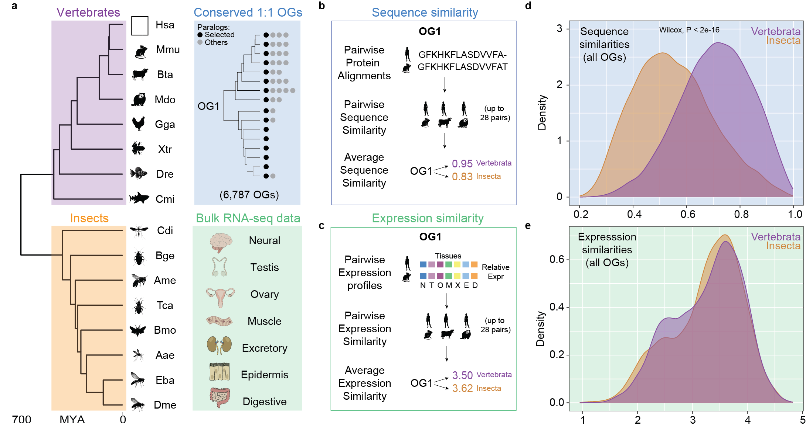

# Sequence and Expression Divergence of Ancestral Genes in Vertebrates and Insects

This github repository contains the code use to perform the analyses and generate the figures associated with the manuscript titled **"Sequence and Expression Divergence of Ancestral Genes in Vertebrates and Insects"** by Federica Mantica and Manuel Irimia (submitted for publication).

Table of contents
-------
* [Study Overview](#study-overview)  
* [Analyses](#analyses)  
* [Figures](#figures)  

### Study Overview 

Vertebrates and insects diverged approximately 700 million years ago, and yet they retain a large core of conserved genes from their last common ancestor. These ancient genes likely present strong evolutionary constraints, which limit their overall sequence and expression divergence. However, evolutionary constraints can greatly vary across ancestral gene families. In few cases, sequence and expression changes resulting from looser constraints mediate functional evolution, as it has been demonstrated for many paralogous genes in closely related species. However, overall patterns of sequence and expression divergence and their potential functional outcome have never been explored in a genome-wide manner across large evolutionary distances in animals. In this study, we focus on approximately 7,000 highly conserved genes shared between vertebrates and insects, investigating global patterns of molecular diversification driven by changes in sequence and expression profiles. We identified molecular features generally linked to higher or lower diversification rates, together with gene groups with similar diversification profiles in both clades. However, we also discovered that some genes underwent differential diversification during vertebrate and insect evolution, potentially contributing to the emergence of unique phenotypes in each clade.

 

<figure>
  
  <figcaption><b>Framework overview and definition of sequence and expression similarities.</b> a. Left: phylogenetic tree including the scientific acronyms of the 8 vertebrate and 8 insect species considered in this study. Hsa: human, Mmu: mouse, Bta: cow, Mdo: opossum, Gga: chicken, Xtr: tropical clawed frog, Dre: zebrafish, Cmi: elephant shark. Dme: fruit fly, Eba: marmalade hoverfly, Aae: yellow fever mosquito, Bmo: domestic silk moth, Tca: red flour beetle, Ame: honey bee, Bge: cockroach, Cdi: mayfly. (see Methods for corresponding scientific names). Top right: example of one the 6,787 considered gene orthogroups. Bottom right: tissues represented in our bulk RNA-seq dataset. Evolutionary distances were derived from timetree (Kumar et al. 2022) (MYA: million years ago) and animal silhouettes were generated through Bing Chat by MIcrosoft (2023) https://www.bing.com/search. b, c. Scheme for the computation of the sequence (b) and expression (c) similarity measures. The depicted procedure was performed separately for vertebrates and insects, returning two values per orthogroup. d, e. Distributions of the sequence (d) and expression (e) similarity values for all gene orthogroups (n=6,788) within vertebrates (purple) and insects (orange).</figcaption>
<figure>

### Analyses  

This folder contains a snakemake pipeline (i.e., **Snakefile**) used to run the majority of computational analyses, together with the relative configuration file (**config.yml**) and a file with the parameters needed for cluster job submission (**cluster.json**). All relevant scripts can be found in the bin subfolder. The Snakefile includes rules to:  

* Compute the **relative expression** across tissues for all the bilaterian-conserved, protein-coding genes of the 16 vertebrates and insect species included in our dataset.  
* Compute average protein **sequence similarities** for each gene orthogroups, starting from all the all species-pairwise similarities between its representative orthologs.  
* Compute pairwise and average **expression similarities** for each gene orthogroups, starting from the relative expression across tissues of all its representative orthologs.  
* Compute pairwise and average spearman **expression correlation** for each gene orthogroups, starting from the relative expression across tissues of all its representative orthologs. 
* Compute pairwise and average **expression euclidean distances** for each gene orthogroups, starting from the relative expression across tissues of all its representative orthologs. 
* Define groups containing **500 most and least conserved gene orthogroups** in terms of sequence or expression similarities between either vertebrates or insects.  
* Perform **GO enrichments** on the previously defined groups. Background is represented by all bilaterian-conserved gene orthogroups.  

### Figures

This folder contains an Rmarkdown file used to generate the majority of the figure panels associated with the publication, and perfomer very few of the less demanding computational analyses. The content includes:  

* **Figure 1**: Framework overview and definition of sequence and expression similarities.  
* **Figure 2**: Correlation of sequence and expression similarities between and within clades.  
* **Figure 3**: Characterization of fast and slow evolving genes.  
* **Figure 4**: Functional categories with common molecular diversification patterns between clades.  
* **Figure 5**: Functional categories with molecular diversification biases between clades.   
* **Supplementary Figure 1**: Comparison between measures of expression conservation.  
* **Supplementary Figure 2**: Deltas of sequence and expression similarities between vertebrates and insects.  
